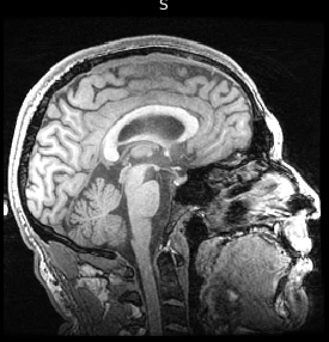

# t1_nose_wrapping_fix
How to fix wrapping artifact in T1 imaging for scans that were not planned correctly at the scanner

# Step1:
Split image into front and back in a way that you avoid the wrapping nose. Select the y-cordinate (voxel not mm) carefully for this 

# Step2:
merge image along y-axis

#Before:

#After:

#Step3:
confirm dimensions match the original image
